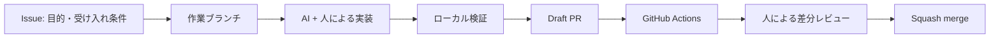

# AI-assisted development template

Codex と Claude Code を安全に併用し、変更の意図・検証結果・レビュー履歴を GitHub に残すための個人開発用テンプレートです。言語やフレームワークに依存しないため、`scripts/check.sh` をプロジェクトに合わせて拡張して使います。

## すぐに始める

1. GitHub の **Use this template** からリポジトリを作成します。
2. ローカルで安全設定を有効化します。
   ```bash
   ./scripts/setup.sh
   ```
3. GitHub CLI でラベルと `main` の保護ルールを設定します（リポジトリ管理権限が必要です）。
   ```bash
   ./scripts/bootstrap-github.sh
   ```
4. Issue を作成し、作業ブランチを切ります。
   ```bash
   git switch -c feat/123-short-description
   ```
5. Codex または Claude Code に Issue URL と受け入れ条件を渡します。AI は `AGENTS.md` / `CLAUDE.md` の制約に従います。
6. `./scripts/check.sh` を通し、Pull Request を作成します。PR 本文に `Closes #123`、AI 利用、検証結果を記録してください。

## 推奨フロー



- **Issue first**: 要求、非目標、受け入れ条件を先に固定します。
- **1 PR = 1目的**: 小さな差分にし、コミットと PR で判断過程を追跡します。
- **AI を明記**: PR テンプレートの AI 欄にツール、用途、人が確認した範囲を書きます。
- **人がマージ**: AI は保護ブランチへ直接 push / merge しません。
- **復旧可能にする**: squash merge と自動生成されたリリースノートで変更単位を明確にします。

## GitHub で有効化する設定

`bootstrap-github.sh` は可能な範囲を自動設定します。GitHub の **Settings → Rules → Rulesets** でも、`docs/github-branch-protection.md` に従って確認してください。特に次を必須にします。

- `main` への pull request、承認 1 件、会話の解決
- `quality / repository checks` の成功
- force push、削除、直接 push の禁止
- 管理者にもルールを適用
- GitHub Actions に read-only の既定権限

## ファイル構成

| ファイル | 役割 |
| --- | --- |
| `AGENTS.md` | Codex を含む AI エージェント共通の作業規約 |
| `CLAUDE.md` | Claude Code の入口（共通規約を参照） |
| `.github/pull_request_template.md` | 変更理由、AI 利用、検証、リスクの記録 |
| `.github/ISSUE_TEMPLATE/` | 機能・不具合を構造化して記録 |
| `.github/workflows/` | PR 検証、依存関係レビュー、CodeQL |
| `.github/CODEOWNERS` | 重要な統制ファイルのオーナー指定 |
| `scripts/check.sh` | ローカルと CI で同じ検査を実行 |
| `scripts/guard-protected-branch.sh` | 保護ブランチ上の変更をローカルでも拒否 |
| `docs/ai-development-guide.md` | AI への依頼・レビューの実践ガイド |
| `docs/branch-workflow.md` | 人が変更を追跡しやすいブランチ・コミット・PR運用 |

## カスタマイズ

- `.github/CODEOWNERS` の `@YOUR_GITHUB_ID` を自分の GitHub ID に置換してください。
- `scripts/check.sh` にプロジェクト固有の formatter、lint、型検査、テスト、build を追加してください。
- Actions の固定バージョンと Dependabot の対象 ecosystem を利用技術に合わせてください。
- 公開リポジトリでは Secret scanning、Push protection、Dependabot alerts も有効にしてください。

## AI に渡してはいけないもの

シークレット、個人情報、本番データ、契約上共有できないコードをプロンプトやリポジトリへ含めないでください。`.env` はコミットせず、`.env.example` にはダミー値だけを置きます。漏えいが疑われる場合は削除だけで済ませず、直ちにシークレットを失効・再発行します。
